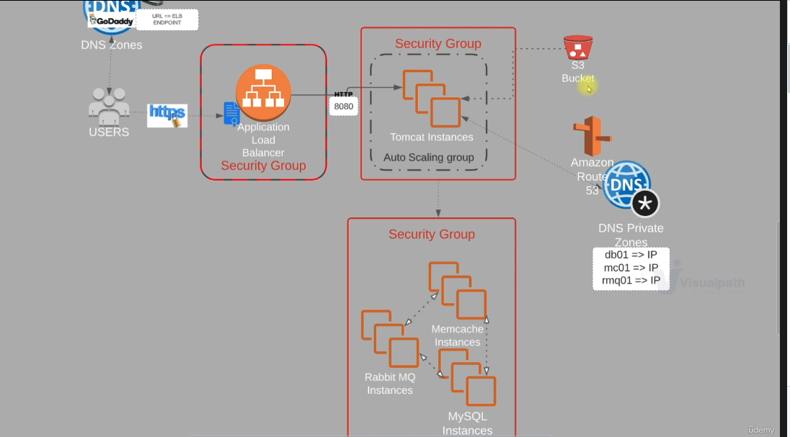

# Project 3 - Lift and Shift - AWS Cloud for the Application Setup

In my previous project, I developed a multi-tier web application using Vagrant. For the current project, my plan is to elevate its operational status by hosting and running it on the AWS cloud for production, employing a lift-and-shift strategy.

## Prerequisites:
 * AWS Account
 * Registered DNS Name
 * Maven
 * JDK8
 * AWS CLI

##### Architecture on AWS:


### 1. Create Security Groups for Services

- Create `<your app name>-ELB-SG` and configure `Inbound` rules to Allow both `HTTP` and `HTTPS` on port `80` and `443` respectively from Anywhere `IPv4` and `IPv6`.
- Create `<your app name>-app-SG`. Open port `8080` to accept connections from previously created `vprofile-ELB-SG`.
- Create `<your app name>-backend-SG`. Open port `3306` for `MySQL`, `11211` for `Memcached` and `5672` for `RabbitMQ` server. All of this information can be found in `application.properties` file in the `src/main/resources` directory. 
- Lastly, open communication in `<your app name>-backend-SG` for `All Traffic` from `<your app name>-backend-SG` to allow backend services to communicate with each other.

### 2. Create KeyPair to Connect EC2 instances

- Create a Keypair to connect our instances via SSH.

### 3. Provision Backend EC2 instances with UserData script

##### DB Instance:

- Create database instance with settings described below. Next, add Inbound rule to `<your app name>-backend-SG` for `SSH` on port `22` from `MyIP` to be able to connect to this database instance via SSH.
```sh
Name: YOUR PROJECT NAME-db01
Project: YOUR PROJECT NAME
AMI: Centos 7
InstanceType: t2.micro
SecGrp: YOUR PROJECT NAME-backend-SG
UserData: mysql.sh
```
- Once the instance is up and running, SSH into the server and check if userdata script is executed.
We can also check status of mariadb.
```sh
ssh -i YOUR KEY PAIR NAME.pem centos@PUBLIC IP OF THIS INSTANCE
sudo -i
curl http://169.254.169.254/latest/user-data
systemctl status mariadb
```

##### Memcached Instance:

- Create Memcached instance with the following settings:
```sh
Name: YOUR APP NAME-mc01
Project: YOUR APP NAME
AMI: Centos 7
InstanceType: t2.micro
SecGrp: YOUR APP NAME-backend-SG
UserData: memcache.sh
```
- Once our instance is ready, we can SSH into the server and check if userdata script is executed.
We can also check status of memcache service and if it is listening on port 11211.
```sh
ssh -i YOUR KEY PAIR NAME.pem centos@PUBLIC IP OF THIS INSTANCE
sudo -i
curl http://169.254.169.254/latest/user-data
systemctl status memcached.service
ss -tunpl | grep 11211
```

##### RabbitMQ Instance:

- Create RabbitMQ instance with the following details:
```sh
Name: YOUR APP NAME-rmq01
Project: YOUR APP NAME
AMI: Centos 7
InstanceType: t2.micro
SecGrp: YOUR APP NAME-backend-SG
UserData: rabbitmq.sh
```
- Once our instance is ready, we can SSH into the server and check if userdata script is executed.
We can also check status of rabbitmq service.
```sh
ssh -i YOUR KEY PAIR NAME.pem centos@PUBLIC IP OF THIS INTANCE
sudo -i
curl http://169.254.169.254/latest/user-data
systemctl status rabbitmq-server
```
_Note: It may take some time to run userdata script after you connect to the server. You can check the process with `ps -ef` to see if the process starts for the service. If it does not, wait some time and check with `systemctl status <service_name>` command again._

### 3. Create Private Hosted Zone in Route53 

- Update Private IP of the backend services in Route53 Private DNS Zone and note down Private IP addresses.
- Create `<your name>` Private Hosted zone in Route53 and pick `Default VPC` in `N.Virginia` region.
- Create records for the backend services in order to use these names in the `application.properties` file (IP may change, these names will be static)  
```sh
Simple Routing -> Define Simple Record
Value/Route traffic to: IP address or another value
```

### 4. Provision Application EC2 instances with UserData script

- Create Tomcat instance with the following details.
```sh
Name: YOUR APP NAME-app01
Project: YOUR APP NAME
AMI: Ubuntu 18.04
InstanceType: t2.micro
SecGrp: YOUR APP NAME-backend-SG
UserData: tomcat_ubuntu.sh
```
- Add Inbound rule to `<your app name>-backend-SG` for `SSH` on port `22` from `My IP` to be able to connect the db instance via SSH.

### 5. Create Artifact Locally with MAVEN

- Clone the repository.
```sh
git clone https://github.com/Veluthil/Vprofile-Project.git
```
- Before creating artifact in `application.properties` file under `/src/main/resources` update the following lines:
```sh
jdbc.url=jdbc:mysql://db01.NAME-OF-PRIVATE-HOSTED-ZONE-FROM-POINT-3:3306/accounts?useUnicode=true&

memcached.active.host=mc01.NAME-OF-PRIVATE-HOSTED-ZONE-FROM-POINT-3

rabbitmq.address=rmq01.NAME-OF-PRIVATE-HOSTED-ZONE-FROM-POINT-3
```
- Go to the root directory, where pom.xml file exists and execute below command:

```sh
mvn install
```

### 6. Create S3 bucket using AWS CLI copy artifact

- In this step you will upload previously created artifact to S3 Bucket from AWS CLI. Tomcat server will get the same artifact from S3 Bucket.

- Create an IAM user for authentication to be used from AWS CLI.
```sh
name: YOUR APP NAME-s3-admin
Access key - Programmatic access
Policy: s3FullAccess
```

- Configure `AWS CLI` to use IAM user credentials.
```sh
aws configure
AccessKeyID: 
SecretAccessKey:
region: us-east-1
format: json
```
- Create bucket with a unique name.
```sh
aws s3 mb s3://YOUR UNIQUE STORAGE NAME 
```
- Go to the target directory and copy the artifact to newly created bucket with the following commands. 
```sh
aws s3 cp vprofile-v2.war s3://YOUR UNIQUE STORAGE NAME 
aws s3 ls YOUR UNIQUE STORAGE NAME 
```
- We can verify the same from AWS Console.

### 7. Download the Artifact to the Tomcat server from S3 Bucket

- In order to download our artifact onto Tomcat server, we need to create IAM role for Tomcat. Once role is created we will attach it to our `app01` server.
```sh
Type: EC2
Name: YOUR NAME FOR THIS ROLE
Policy: s3FullAccess
```
- Before we login to our server, we need to add SSH access on port 22 to our `YOUR APP NAME-app-SG`.
- Then connect to `app011` Ubuntu server.
```sh
ssh -i "YOUR KEY PAIR NAME.pem" ubuntu@PUBLIC IP OF THIS SERVER
sudo -i
systemctl status tomcat8
```
- Stop Tomcat server. 
- Delete `ROOT` directory, where the default tomcat app files are stored, under `/var/lib/tomcat8/webapps/` path. Before deleting it we need to stop Tomcat server. 
```sh
cd /var/lib/tomcat8/webapps/
systemctl stop tomcat8
rm -rf ROOT
```
- Download the previously created artifact from the S3 Bucket using AWS CLI commands. 
- First, install `AWS CLI`. 
- Download the artifact to the `/tmp` directory, then copy it to `/var/lib/tomcat8/webapps/` directory as `ROOT.war`. Since this is the default app directory, Tomcat will extract the compressed file automatically.
```sh
apt install awscli -y
aws s3 ls s3://YOUR UNIQUE STORAGE NAME 
aws s3 cp s3://YOUR UNIQUE STORAGE NAME/vprofile-v2.war /tmp/vprofile-v2.war
cd /tmp
cp vprofile-v2.war /var/lib/tomcat8/webapps/ROOT.war
systemctl start tomcat8
```

- Verify whether the `application.properties` file has the latest changes.
```sh
cat /var/lib/tomcat8/webapps/ROOT/WEB-INF/classes/application.properties
```
- Validate network connectivity from server using for example `telnet`.
```sh
apt install telnet
telnet db01.NAME-OF-PRIVATE-HOSTED-ZONE-FROM-POINT-3 3306
```

### 8. Setup LoadBalancer

- Create Target Group.
```sh
Intances
Target Grp Name: YOUR NAME FOT THE TARGET GROUP-TG
protocol-port: HTTP:8080
healtcheck path : /login
Advanced health check settings
Override: 8080
Healthy threshold: 3
available instance: app01 (Include as pending below)
```
- Create Load Balancer.
```sh
CHOOSE-A-NAME-prod-elb
Internet Facing
Select all AZs
SecGrp: NAME FOR THE SG-elb-secGrp
Listeners: HTTP, HTTPS
Select the certificate for HTTPS
```

### 9. Create Route53 record for ELB endpoint

- Create an A record with alias to ALB in order to use the domain name to reach the application.

- Check the application using selected DNS via https.


### 10. Configure AutoScaling Group for Application Instances

- Create an AMI from the App Instance.

- Create a Launch template using the AMI created in the above step for the ASG.
```sh
Name: PROJECT NAME-LT
AMI: PROJECT NAME-app-image
InstanceType: t2.micro
IAM Profile: PREVIOUSLY MADE ARTIFACT STORAGE ROLE
SecGrp: YOUR APP SECGRP-app-SG
KeyPair: YOUR KEY PAIR-prod-key
```
- Create our ASG.

```sh
Name: PROJECT NAME-app-ASG
ELB healthcheck
Add ELB
Min: 1
Desired: 2
Max: 4
Target Tracking-CPU Utilization 50
```
- If you terminate any instancea the ASG will create a new one using just created LT.


### 11. Cleaning up

- Delete all the resources created to avoid charges from the AWS.