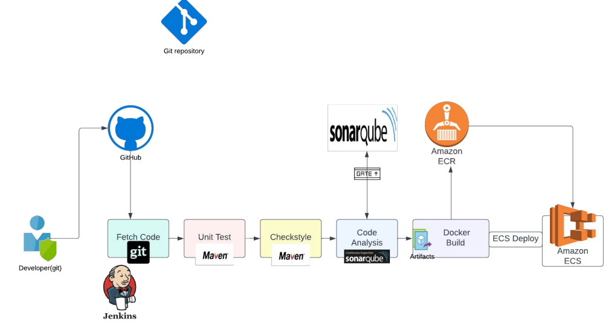
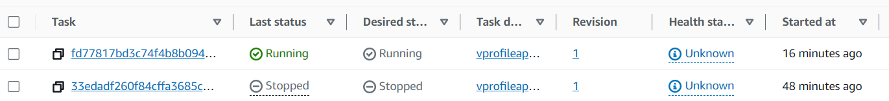

# Project 6 - CI/CD Project with Jenkins and Docker (Docker PAAC)

## Prerequisities:

 * AWS Account
 * GitHub account
 * EC2 with Jenkins from previous project 
 * EC2 with SonarQube from previous project
 * Docker Engine in Jenkins
 * AWS CLI
 * IAM User
 * ECR repo
 * ECS cluster
 * Plugins in Jenkins: ECR, Docker pipeline, AWS SDK for credentials

 ## Project Architecture
 

 ### 1. Install Docker Engine on the Jenkins Server

 - SSH to your Jenkins instance and use the following commands:
 ```sh
 sudo -i
 sudo apt update && sudo apt install awscli -y
 # Update the apt package index and install packages to allow apt to use a repository over HTTPS
 sudo apt-get update
 sudo apt-get install ca-certificates curl gnupg
 # Add Docker's official GPG key
 sudo install -m 0755 -d /etc/apt/keyrings
 curl -fsSL https://download.docker.com/linux/ubuntu/gpg | sudo gpg --dearmor -o /etc/apt/keyrings/docker.gpg
 sudo chmod a+r /etc/apt/keyrings/docker.gpg
 # Use the following command to set up the repository
  echo \
  "deb [arch="$(dpkg --print-architecture)" signed-by=/etc/apt/keyrings/docker.gpg] https://download.docker.com/linux/ubuntu "$(. /etc/os-release && echo "$VERSION_CODENAME")" stable" | sudo tee /etc/apt/sources.list.d/docker.list > /dev/null
 #Update the apt package index
 sudo apt-get update 
 # To install the latest version, run:
 sudo apt-get install docker-ce docker-ce-cli containerd.io docker-buildx-plugin docker-compose-plugin -y
 # Verify that the Docker Engine installation is successful by running the hello-world image.
 sudo docker run hello-world
 # You can also check its status by running:
 systemctl status docker
```
- All of the Jenkins jobs run with a Jenkins user, therefore you need to add Jenkins user to the docker group to allow it run docker commands.
- Make sure you are now a root user and run:
```sh
 usermod -a -G docker jenkins
 reboot
```

### 2. Create IAM user and ECR repository.

- Go to IAM service in your AWS -> `Create user`:
```
User name: jenkins
Attach policies directly:
- AmazonEC2ContainerRegistryFullAccess
- AmazonECS_FullAccess
```
- Create user with above settings and next create an access key for this user. Go to `jenkins` user -> `Security Credentials` -> `Access keys` -> `Create access key`:
```
Use case: CLI
Check: I understand the above...
Create access key
```
- Download .csv file.
- Create ECR repository. Go to `Elastic Container Registry` service -> `Repositories` -> `Create Repository`:
```
Visibility settings: Private
Repository name: vprofileappimg [or whatever you like]
Create repository
```
- Copy the URI and store it for later.

### 3. Install plugins.

- Go to Jenkins `http://JENKINS PUBLIC IP:8080` -> `Manage Jenkins` -> `Plugins` -> `Available` and install without restart:
  - Docker Pipeline
  - Amazon ECR
  - Amazon Web Services SDK :: All
  - CloudBees Docker Build and Publish

### 4. Store AWS credentials.

- Go to `Manage Jenkins` -> `Credentials` -> `Stores scoped to Jenkins` -> `Jenkins/System` -> `Global credentials (unrestricted)` -> `Add credentials`:
```
Kind: AWS Credentials
ID: awscredentials [or whatever you like]
Description: awscredentials
Access Key ID: PASTE HERE ACCESS KEY FROM THE .CSV DOWNLOADED IN THE 2 STEP
Secret Access Key: PASTE HERE SECRET ACCESS KEY FROM THE .CSV DOWNLOADED IN THE 2 STEP
```
- And click OK.

### 5. Create a Jenkins pipeline.

- Create a new item in Jenkins (for example 'docker-ci-pipeline'), choose pipeline and paste the following script (remember to fill it with your own data).

```groovy
pipeline {
    agent any
    tools {
	    maven "MAVEN3"
	    jdk "OracleJDK8"
	}

    environment {
        registryCredential = 'ecr:YOUR_AWS_REGION:awscredentials'
        appRegistry = "URI FROM THE 2 STEP"
        vprofileRegistry = "https://URI FROM THE 2 STEP WITHOUT /REPOSITORY NAME"
    }
  stages {
    stage('Fetch code'){
      steps {
        git branch: 'docker', url: 'https://github.com/devopshydclub/vprofile-project.git'
      }
    }


    stage('Test'){
      steps {
        sh 'mvn test'
      }
    }

    stage ('CODE ANALYSIS WITH CHECKSTYLE'){
            steps {
                sh 'mvn checkstyle:checkstyle'
            }
            post {
                success {
                    echo 'Generated Analysis Result'
                }
            }
        }

        stage('build && SonarQube analysis') {
            environment {
             scannerHome = tool 'sonar4.7'
          }
            steps {
                withSonarQubeEnv('sonar') {
                 sh '''${scannerHome}/bin/sonar-scanner -Dsonar.projectKey=vprofile \
                   -Dsonar.projectName=vprofile-repo \
                   -Dsonar.projectVersion=1.0 \
                   -Dsonar.sources=src/ \
                   -Dsonar.java.binaries=target/test-classes/com/visualpathit/account/controllerTest/ \
                   -Dsonar.junit.reportsPath=target/surefire-reports/ \
                   -Dsonar.jacoco.reportsPath=target/jacoco.exec \
                   -Dsonar.java.checkstyle.reportPaths=target/checkstyle-result.xml'''
                }
            }
        }

        stage("Quality Gate") {
            steps {
                timeout(time: 1, unit: 'HOURS') {
                    // Parameter indicates whether to set pipeline to UNSTABLE if Quality Gate fails
                    // true = set pipeline to UNSTABLE, false = don't
                    waitForQualityGate abortPipeline: true
                }
            }
        }

    stage('Build App Image') {
       steps {
         script {
                dockerImage = docker.build( appRegistry + ":$BUILD_NUMBER", "./Docker-files/app/multistage/")
             }
     }
    }

    stage('Upload App Image') {
          steps{
            script {
              docker.withRegistry( vprofileRegistry, registryCredential ) {
                dockerImage.push("$BUILD_NUMBER")
                dockerImage.push('latest')
              }
            }
          }
     }
  }
}
```
- Save and build now.
_Note: if your build fails due to the lack of memory, do the following steps:_
_Stop your instance, go to the volume, find root volume of your instance._
_Select volume, Edit, Modify, In Size change from 8 to 15 GB._
- After finishing the build successfully, you should see an image tag in your ECR - with each new build run, you will see here new images with different tags. This images can be uploaded to various providers, like K8s, Docker Engine, AWS ECS.

## So far we have managed to achieve Continuous Integration with Docker, now let's move to the final part - Continuous Deployment with Elastic Container Service (in the next projects we will be using Kubernetes for that).

### 6. Create ECS cluster.

- Go to `ECS` in your AWS -> switch on the `New ECS Experience` -> `Clusters` -> `Create Cluster`:
```
Cluster name: vprofile
#Monitoring: toggle on 'Use Container Insights' - optional
Tags: 
Name: vprofile
```
_Note: If you get an error after trying to create this cluster, do the above step once more._

- Now, create Task definitions:
```
Task definition family: vprofileapptask
Memory: 2GB
Container - 1:
Name: vproapp
Image URI: COPY FROM THE ECR
Port mappings:
Container port: 8080
Tags: 
Name: vprofileapptask
```
- After creating this task definition, click on it and go to `Task execution role` - we have to add CloudWatch policy to this role. Click on `Add permissions` -> `Attach policies` -> attach `CloudWatchLogsFullAccess`.

- Go to the created cluster -> `Services` -> `Create`:
```
Family: SELECT YOUR TASK DEFINITION
Revision: 1 (LATEST)
Service name: vprofileappsvc
Deployment failure detection: uncheck to avoid additional costs
Networking:
Security Group: Create a new security group
  Name: vproappecselb-sg
  Description: vproappecselb-sg
  Inbound rules:
    HTTP from Anywhere
    Custom TCP port 8080 from Anywhere
Load balancing:
  Load balancer type: Application Load Balancer
  Create a new load balancer:
    Name: vproappelbecs
    Target group name: vproecstg
    Health check path: /login #this is specific for vprofile app
```
- Click on `Create` and wait for finishing the creation, them click on the service - from there you can go to the Load Balancers, also check the Target Group. In ECS you should see one running task - this is our container - click on it and go to `Logs`. These are the logs generated by the container.
- Go back to `Service` -> `Networking` -> copy the DNS endpoint and go this URL.
- Congratulations, you should see the running app. For now this in only a frontend, so you won't be able to login to it.

### 7. Updating the pipeline on Jenkins.

- First, get the cluster name (vprofile).
- Next, the service name (vprofileappsvc).
- Make sure that your Jenkins service has an AWS CLI installed.
- Update this Jenkinsfile with these information:
```groovy
pipeline {
    agent any
    tools {
	    maven "MAVEN3"
	    jdk "OracleJDK8"
	}

    environment {
        registryCredential = 'ecr:YOUR_AWS_REGION:awscredentials'
        appRegistry = "URI FROM THE 2 STEP"
        vprofileRegistry = "https://URI FROM THE 2 STEP WITHOUT /REPOSITORY NAME"
        cluster = "vprofile"
        service = "vprofileappsvc"
    }
  stages {
    stage('Fetch code'){
      steps {
        git branch: 'docker', url: 'https://github.com/devopshydclub/vprofile-project.git'
      }
    }


    stage('Test'){
      steps {
        sh 'mvn test'
      }
    }

    stage ('CODE ANALYSIS WITH CHECKSTYLE'){
            steps {
                sh 'mvn checkstyle:checkstyle'
            }
            post {
                success {
                    echo 'Generated Analysis Result'
                }
            }
        }

        stage('build && SonarQube analysis') {
            environment {
             scannerHome = tool 'sonar4.7'
          }
            steps {
                withSonarQubeEnv('sonar') {
                 sh '''${scannerHome}/bin/sonar-scanner -Dsonar.projectKey=vprofile \
                   -Dsonar.projectName=vprofile-repo \
                   -Dsonar.projectVersion=1.0 \
                   -Dsonar.sources=src/ \
                   -Dsonar.java.binaries=target/test-classes/com/visualpathit/account/controllerTest/ \
                   -Dsonar.junit.reportsPath=target/surefire-reports/ \
                   -Dsonar.jacoco.reportsPath=target/jacoco.exec \
                   -Dsonar.java.checkstyle.reportPaths=target/checkstyle-result.xml'''
                }
            }
        }

        stage("Quality Gate") {
            steps {
                timeout(time: 1, unit: 'HOURS') {
                    // Parameter indicates whether to set pipeline to UNSTABLE if Quality Gate fails
                    // true = set pipeline to UNSTABLE, false = don't
                    waitForQualityGate abortPipeline: true
                }
            }
        }

    stage('Build App Image') {
       steps {
       
         script {
                dockerImage = docker.build( appRegistry + ":$BUILD_NUMBER", "./Docker-files/app/multistage/")
             }

     }
    
    }

    stage('Upload App Image') {
          steps{
            script {
              docker.withRegistry( vprofileRegistry, registryCredential ) {
                dockerImage.push("$BUILD_NUMBER")
                dockerImage.push('latest')
              }
            }
          }
     }
     
     stage('Deploy to ecs') {
          steps {
        withAWS(credentials: 'awscredentials', region: 'YOUR AWS REGION') {
          sh 'aws ecs update-service --cluster ${cluster} --service ${service} --force-new-deployment'
        }
      }
     }

  }
}
```
- Go to `Jenkins` -> `Manage Jenkins` -> `Plugins` -> `Available` -> find and install without restart `Pipeline: AWS Steps`.
- Create new item, for example `cicd-pipeline-ecs`, choose `Pipeline` and paste the above groovy script. Save it.
- Go to the ECS and make sure that everything works properly. Note down the container ID (you can find it in task, in the `Container runtime ID` column). When we will run our pipeline, the new container will be created and this one will be deleted.
- Go to Jenkins and Build Now.
- When the deployment is completed, check the ECS service and refresh, then click on this service and go to `Deployments`. You should see a new task being created. The old task will be deleted. You can check the running container ID and compare it to the previously saved one in order to make sure it has worked. After some time there will be only one task. 
- Under the Clusters > vprofile > Tasks you should see similar view:


## Congratulations, this is the end of this project. Now, do the clean up in order to avoid costs.

### 8. Clean up.

- You can keep the Jenkins EC2 for the later projects, however, you should stop this instance. Nexus and SonarQube can be terminated.
- ECS Cluster -> go to the `Service` -> `Update Service`:
```
Desired tasks: 0
```
- You can also stop the task, if it is still running.
- Then delete the service.
- Go to `Clusters` -> click on the cluster (vprofile) -> `Delete cluster`
